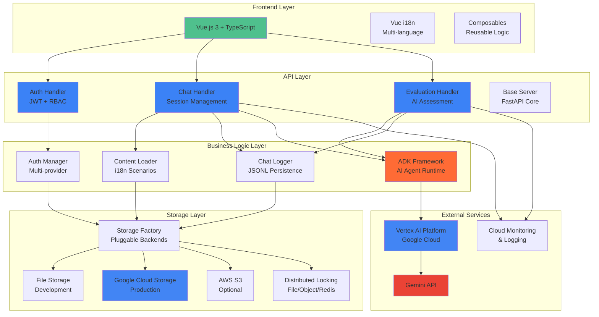

# Role Play System (RPS)

> **An AI-powered, multilingual role-playing conversation platform that transforms how we practice and learn through interactive scenarios.**

## What Makes RPS Special

**RPS is not just another chatbot platform.** It's a comprehensive ecosystem designed for **educational institutions, corporate training, and other types of learning** that provides:

- **LLM-Powered Characters**: Sophisticated role-play scenarios with Gemini 2.0 Flash integration
- **Comprehensive Analytics**: Built-in evaluation system with detailed performance reports
- **Educational Focus**: Purpose-built for learning scenarios like medical interviews, customer service training, and job preparation

---

## System Architecture



### Technical Stack

| Layer | Technology | Purpose |
|-------|------------|---------|
| **Frontend** | Vue.js 3 + TypeScript | Reactive UI with type safety |
| **API** | FastAPI + Pydantic | High-performance async API |
| **AI Engine** | Gemini 2.0 Flash | Advanced conversational AI |
| **Storage** | GCS/S3/FileSystem | Distributed, scalable data persistence |
| **Auth** | JWT + RBAC | Secure authentication & authorization |
| **i18n** | Vue i18n + Backend | Native multi-language support |
| **Deployment** | Cloud Run + Docker | Container-native auto-scaling |

---

## Quick Start

### **Option 1: Docker (Recommended for Demo)**

```bash
git clone https://github.com/yourusername/rps.git
cd rps
make run-local-docker
```

**→ Open http://localhost:8080** 🎉

### **Option 2: Local Development**

```bash
# Backend
python3 -m venv venv && source venv/bin/activate
pip install -r src/python/requirements-all.txt
export JWT_SECRET_KEY="demo-secret-key"
python src/python/run_server.py &

# Frontend
cd src/ts/role_play/ui
npm install && npm run dev

# → Frontend: http://localhost:3000
```

---

## Key Features & Innovation

### **Educational Scenarios**

- **Medical Training**: Patient interview simulations with realistic cases
- **Customer Service**: Handle difficult customer interactions
- **Job Interviews**: Practice with AI interviewers in multiple languages

### **Intelligent Evaluation System**

- **Real-time Assessment**: AI evaluates conversation quality
- **Detailed Reports**: Communication skills, cultural sensitivity, technical accuracy

## Architectural Highlights

### **Microservices-Ready Design**

```python
# Stateless handlers with dependency injection
class ChatHandler(BaseHandler):
    def __init__(self, auth_manager: AuthManager, chat_logger: ChatLogger):
        self.auth_manager = auth_manager  # Injected dependencies
        self.chat_logger = chat_logger    # Thread-safe services
```

### **Multi-Environment Support**

| Environment | Storage | AI Model | Features |
|-------------|---------|----------|----------|
| **Development** | File System | Gemini Flash | Hot reload, debug mode |
| **Beta** | Google Cloud Storage | Gemini Flash | Production testing |
| **Production** | GCS + Monitoring | Gemini 2.0 Flash | Auto-scaling, alerts |

### **Pluggable Storage Architecture**

```python
# Switch storage backends via environment variables
STORAGE_TYPE=gcs GCS_BUCKET=prod-bucket python run_server.py
STORAGE_TYPE=s3 S3_BUCKET=backup-bucket python run_server.py
STORAGE_TYPE=file STORAGE_PATH=./local-data python run_server.py
```
## Testing & Quality

###  **Comprehensive Test Suite**

```bash
# 260+ tests with 54% coverage
make test                  # Full suite with coverage
make test-chat            # Chat module only
make test-integration     # Cross-module tests
make test-coverage-html   # Detailed HTML reports
```

### **Code Quality Metrics**

- **Type Safety**: 100% TypeScript frontend, Python type hints
- **Test Coverage**: 54% overall, 90%+ for critical paths
- **Documentation**: Comprehensive API docs + architecture guides
- **Security**: JWT tokens, RBAC, input validation

---

## Internationalization (i18n)

### **Supported Languages**

| Language | Status | Content Scenarios | UI Translation |
|----------|--------|-------------------|----------------|
| **English** | ✅ Complete | 2 scenarios, 4 characters | ✅ Full |
| **Traditional Chinese** | ✅ Complete | 3 scenarios, 6 characters | ✅ Full |
| **Japanese** | 🚧 Prepared | Ready for content | 🚧 Ready |

### **Language Switching Flow**

```vue
<!-- User clicks language switcher -->
<LanguageSwitcher @change="handleLanguageChange" />

<!-- System updates: -->
<!-- 1. Vue i18n locale -->
<!-- 2. Backend user preference -->
<!-- 3. Content filtering -->
<!-- 4. AI conversation context -->
```

---

## API Documentation

### **Authentication Endpoints**

```bash
POST /api/auth/register     # User registration
POST /api/auth/login        # JWT authentication
GET  /api/auth/me          # Current user profile
PATCH /api/auth/language   # Update language preference
```

### **Chat Endpoints**

```bash
GET  /api/chat/content/scenarios           # Available scenarios
GET  /api/chat/content/scenarios/{id}/characters  # Scenario characters
POST /api/chat/session                     # Create new session
POST /api/chat/session/{id}/message        # Send message
GET  /api/chat/session/{id}/export-text    # Export conversation
```

### **Evaluation Endpoints**

```bash
GET  /api/eval/session/{id}/report         # Latest evaluation
POST /api/eval/session/{id}/evaluate       # Generate new evaluation
GET  /api/eval/session/{id}/all_reports    # Historical evaluations
```

** See [API.md](./API.md) for complete documentation**

---

## Deployment Guide

### **Cloud Deployment (Production)**

```bash
# Set up GCP infrastructure
make setup-gcp-infra ENV=prod

# Deploy application
make deploy ENV=prod

# Custom domain setup
gcloud run domain-mappings create \
  --service=rps-api-prod \
  --domain=rps.yourdomain.com
```

### **Environment Configuration**

```bash
# Development
ENV=dev STORAGE_TYPE=file python run_server.py

# Beta testing
ENV=beta STORAGE_TYPE=gcs GCS_BUCKET=beta-bucket python run_server.py

# Production
ENV=prod GCS_BUCKET=prod-bucket JWT_SECRET_KEY=secure-key python run_server.py
```

** See [DEPLOYMENT.md](./DEPLOYMENT.md) for detailed instructions**
